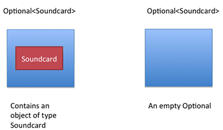

## Optional

### What is `Optional`?
Java SE 8 introduces a new class called `java.util.Optional<T>`. It is a class that encapsulates an optional value.
Optional is a single-value container that either contains a value or doesn't.

### Why do we need `Optional`?
**Without Optional**

What's possibly problematic with the following code?

`String version = computer.getSoundcard().getUSB().getVersion();`

A common (bad) practice is to return the null reference to indicate the absence of a sound card. Unfortunately,
this means the call to `getUSB()` will try to return the USB port of a null reference,
which will result in a `NullPointerException` at runtime and stop the program from running further.

**With Optional**



We can update our model to make use of Optional, as shown below -

```java
public class Computer {
  private Optional<Soundcard> soundcard;  
  public Optional<Soundcard> getSoundcard() { ... }
}

public class Soundcard {
  private Optional<USB> usb;
  public Optional<USB> getUSB() { ... }
}

public class USB{
  public String getVersion(){ ... }
}
```

The code below shows how typical **null-check** patterns can be rewritten using `Optional` -

```java
String name = computer.flatMap(Computer::getSoundcard)
        .flatMap(Soundcard::getUSB)
        .map(USB::getVersion)
        .orElse("UNKNOWN");
```

### Creating optional object
`Optional<String> empty = Optional.empty();`

```java
String name = "baeldung";
Optional<String> opt = Optional.of(name);
```

### Checking Value Presence: isPresent() and isEmpty()

```java
Optional<String> opt = Optional.of(name);
System.out.println(opt.isPresent());
System.out.println(opt.isEmpty());
```

### Conditional Action With ifPresent()

```java
Optional<String> opt = Optional.of("baeldung");
opt.ifPresent(name -> System.out.println(name.length()));
```

### Default Value With orElse()
### Default Value With orElseGet()
### Exceptions With orElseThrow()
###  Returning Value With get()
### Conditional Return With filter()
```java
public void whenOptionalFilterWorks_thenCorrect() {
    Integer year = 2016;
    Optional<Integer> yearOptional = Optional.of(year);
    boolean is2016 = yearOptional.filter(y -> y == 2016).isPresent();
    boolean is2017 = yearOptional.filter(y -> y == 2017).isPresent();
}
```


For more details read the references.

#### Ref:
- https://www.baeldung.com/java-optional
- https://www.oracle.com/technical-resources/articles/java/java8-optional.html